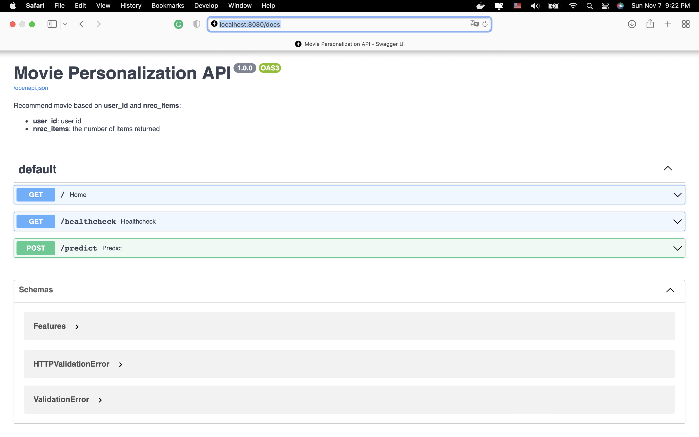
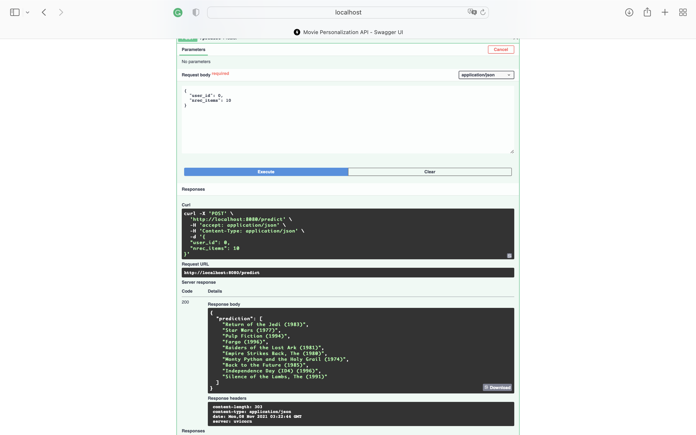

# Deploying a Recommendation Engine to Amazon EKS with CircleCI

## Overview
I containerized a movie recommendation Flask App using Docker and deployed the App to a Kubernetes cluster with a CI/CD pipeline. I associated the pipeline's one end to the Github repository (containing the application code), and connected the other end to the EKS cluster. Below is the architecture diagram of the deployed App with four main actions:


1. Code check-in - The application code for the Flask app is hosted on Github. Multiple contributors can contribute to the repository collaboratively.

2. Trigger Build - As soon as a commit happens in the Github repository, it will trigger the CodeBuild. This step requires connecting the Github account to the AWS CodeBuild service using a GitHub access token. Codebuld will build a new image for the application.

3. Automatic Deployment - The CodePipeline service will automatically deploy the application image to the Kubernetes cluster.

4. Service - Kubernetes cluster will start serving the application endpoints. To the end-user, there is an abstraction of the internal details of the cluster, such as nodes, PODs, containers, and the architecture.

## Flask App
The Flask app consists of a simple API with three endpoints:
- `GET '/'`: This is a simple home page, which returns the response "Welcome: Movie Recommendation API Home".
- `Get '/healthcheck'`: This is a simple health check, which returns the status code and whether the recommendation engine model has been loaded.
- `POST '/predict'`: This takes a user_id and nrec_items as json arguments and returns a list of movies.


## Dependencies
- CircleCI
- Docker Engine
- AWS

## Project Steps
### Run the API Locally using the Flask Server
- Create and activate the python environment: `python3 -m venv ~/.devops` and `source ~/.devops/bin/activate`.
- Install python dependencies: `pip install -r requirements.txt`.
- Start the app: `gunicorn -k uvicorn.workers.UvicornWorker -b :5000 main:app`
- Generate recommendations: `bash make_prediction.sh 5000`


### Containerize the Flask App and Run Locally
- Prerequisite - Docker Desktop: If you haven't installed Docker already, you should install now using [these installation instructions](https://docs.docker.com/get-docker/).
- Build an image: `bash run_docker.sh`
- Generate recommendations: `bash make_prediction.sh 80`


### Create an EKS Cluster and IAM Role
1. Create an EKS (Kubernetes) Cluster
    - Create an EKS cluster named “recommendation-engine-api” in a region of your choice:
        ```
        # Create a cluster
        eksctl create cluster --name recommendation-engine-api
        ```
    - Verify: `kubectl get nodes`.


    - Delete: `eksctl delete cluster recommendation-engine-api  --region=<REGION>`
2. Create an IAM Role
    - Get your AWS account id by running `aws sts get-caller-identity --query Account --output text`.
    - Create a trust relationship. To do this, create a blank trust.json file, add the following content to it and replace the <ACCOUNT_ID> with your actual account Id.
        ```
        {
            "Version": "2012-10-17",
            "Statement": [
                {
                    "Effect": "Allow",
                    "Principal": {
                        "AWS": "arn:aws:iam::<ACCOUNT_ID>:root"
                    },
                    "Action": "sts:AssumeRole"
                }
            ]
        }
        ```
    - Create a role, 'FlaskDeployCBKubectlRole', using the trust.json trust relationship:
        ```
        aws iam create-role --role-name FlaskDeployCBKubectlRole --assume-role-policy-document file://trust.json --output text --query 'Role.Arn'
        ```
    - Create a policy document, `iam-role-policy.json`, that allows (whosoever assumes the role) to perform specific actions (permissions) - "eks:Describe*" and "ssm:GetParameters" as:
        ```
        {
            "Version": "2012-10-17",
            "Statement":[{
                "Effect": "Allow",
                "Action": ["eks:Describe*", "ssm:GetParameters"],
                "Resource":"*"
            }]
        }
        ```
    - Attach the iam-role-policy.json policy to the 'FlaskDeployCBKubectlRole' by running:
        ```
        aws iam put-role-policy --role-name FlaskDeployCBKubectlRole --policy-name eks-describe --policy-document file://iam-role-policy.json
        ```
    - Verify the newly created role in the IAM service

3. Allowing the new role access to the cluster.

    - Fetch: Get the current configmap and save it to a file:
        ```
        # Mac/Linux
        # The file will be created at `/System/Volumes/Data/private/tmp/aws-auth-patch.yml` path

        kubectl get -n kube-system configmap/aws-auth -o yaml > /tmp/aws-auth-patch.yml

        # Windows
        # The file will be created in the current working directory

        kubectl get -n kube-system configmap/aws-auth -o yaml > aws-auth-patch.yml
        ```
    - Edit: Open the aws-auth-patch.yml file using any editor, such as VS code editor:
        ```
        # Mac/Linux
        code /System/Volumes/Data/private/tmp/aws-auth-patch.yml
        # Windows
        code aws-auth-patch.yml
        ```
        Add the following group in the data → mapRoles section of this file.
        ```
        mapRoles: |
            - groups:
            - system:masters
            rolearn: arn:aws:iam::802504168056:role/FlaskDeployCBKubectlRole
            username: build
        ```
    - Update: Update your cluster's configmap:
        ```
        # Mac/Linux
        kubectl patch configmap/aws-auth -n kube-system --patch "$(cat /tmp/aws-auth-patch.yml)"

        # Windows
        kubectl patch configmap/aws-auth -n kube-system --patch "$(cat aws-auth-patch.yml)"
        ```
        The command above must show you `configmap/aws-auth patched` as a response.

### Deployment to Kubernetes using CodePipeline and CodeBuild
1. Generate a Github access token [here](https://github.com/settings/tokens/).
2. Create a pipeline using CloudFormation template

    - Modify the template: open `ci-cd-codepipeline.cfn.yml` and go to the 'Parameters' section. These are parameters that will accept values when you create a stack. Fill in the value for the following parameters:

        | Parameter       	| Field   	| Possible Value                                            	|
        |-----------------	|---------	|-----------------------------------------------------------	|
        | EksClusterName  	| Default 	| recommendation-engine-api                                            	|
        | GitSourceRepo   	| Default 	| Deploying-a-Recommendation-Engine-to-Amazon-EKS-with-a-CI-CD-pipeline 	|
        | GitBranch       	| Default 	| main                                                      	|
        | GitHubUser      	| Default 	| Your Github username                                      	|
        | KubectlRoleName 	| Default 	| FlaskDeployCBKubectlRole                                  	|

    - Create Stack
    Use the AWS web-console to create a stack for CodePipeline using the CloudFormation template file `ci-cd-codepipeline.cfn.yml`. Go to the CloudFormation service in the AWS console. Press the Create Stack button. It will make you go through the following three steps:

        Step 1. Specify template - Choose the options "Template is ready" and "Upload a template file" to upload the template file ci-cd-codepipeline.cfn.yml. Click the 'Next' button.

        Step 2. Specify stack details - Give the stack a name, fill in the Github access token generated in the previous step.

        Step 3. Configure stack options - Leave default, and create the stack.
3. CodeBuild
    In the previous step, the CloudFormation template file, ci-cd-codepipeline.cfn.yml, will automatically create a CodeBuild project. By default, the build process depends on the buildspec.yml file.
    - Details of the buildspec.yml: The buildspec.yml file specifies the different phases of a build, such as an install, pre-build, build, and post-build. Each phase has a set of commands to be automatically executed by CodeBuild. When you trigger a build in the CodeBuild, you can see each command being executed in the CodeBuild log console.
    - Trigger: Start the build process by clicking on the “Start build” button in the CodeBuild dashboard.
4. Test the stack and API endpoints.
    To check if the pipeline works, commit a change to the master branch of your Github repo. In the AWS console go to the CodePipeline dashboard. You should see that the build is running.
    ```
    git add .
    git commit -m “my comment“
    git push
    ```

    To test your API endpoints, get the external IP for your service by running `kubectl get services recommendation-engine-api -o wide`.

    Use the external IP url to test the app:
    ```
    curl -d '{"user_id": 0, "nrec_items": 10}' \
     -H "Content-Type: application/json" \
     -X POST <EXTERNAL-IP URL>/predict
    ```


